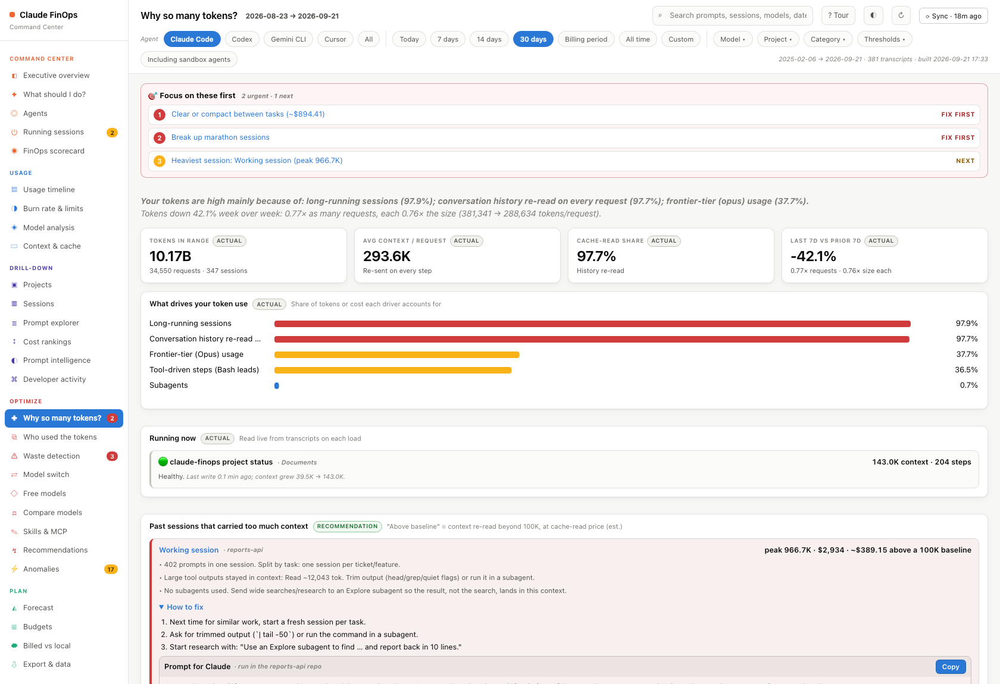
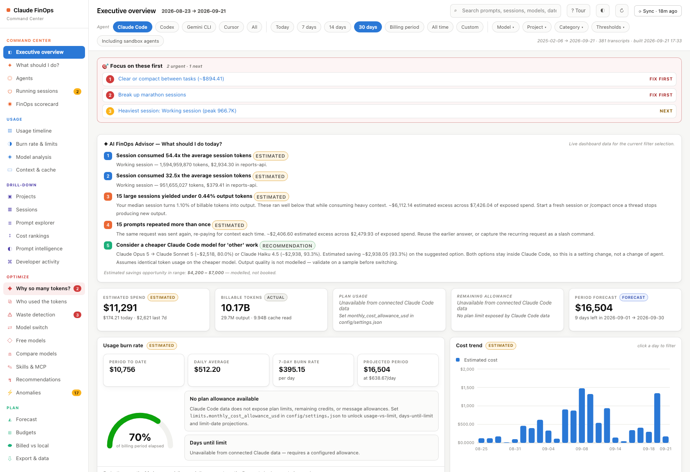
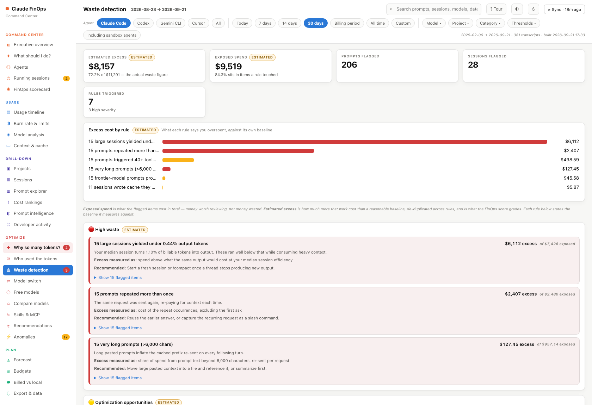
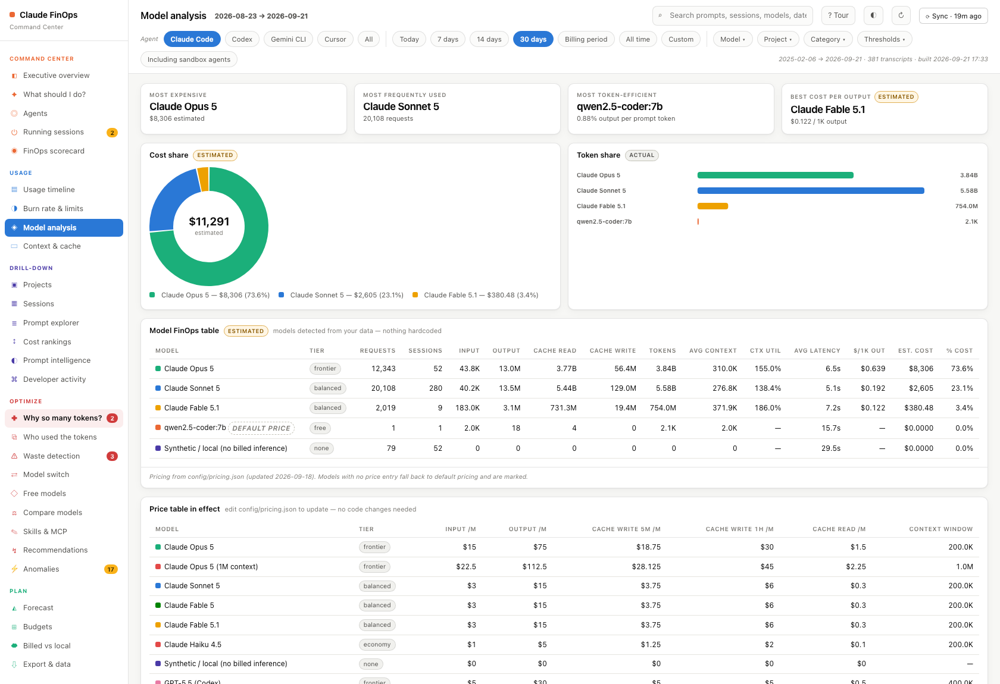
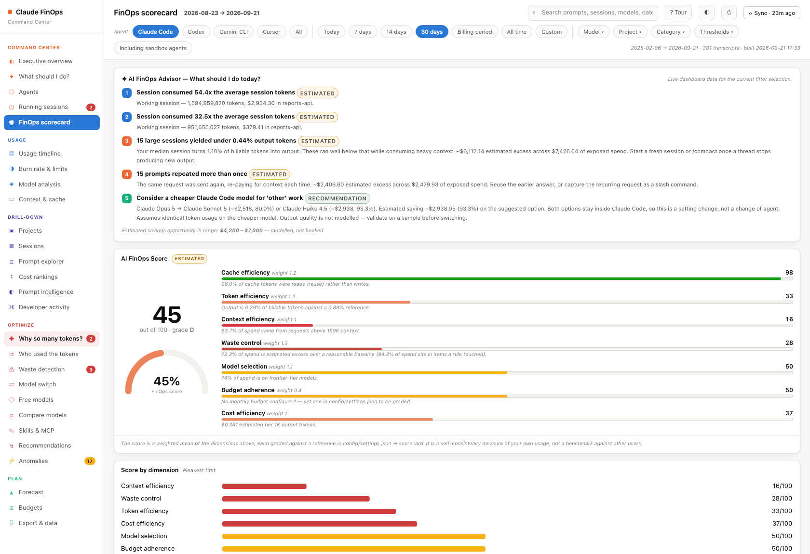
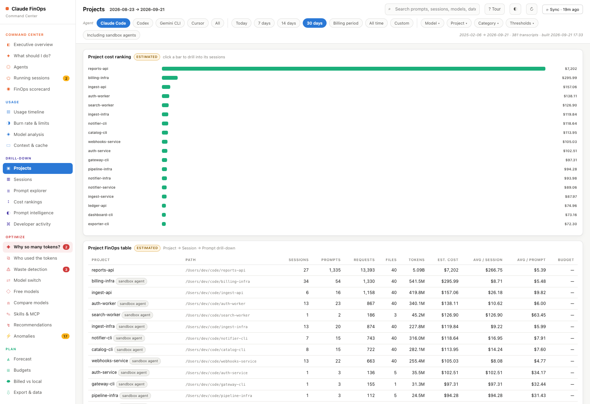
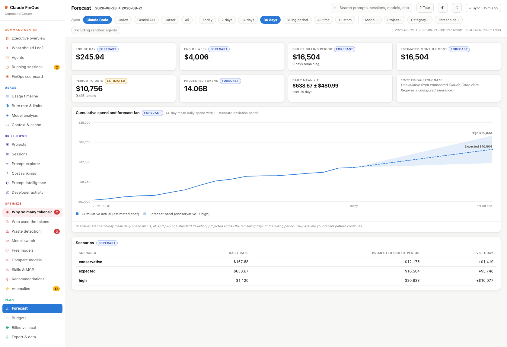

# Product Hunt launch — Claude FinOps

Copy-paste kit for the Product Hunt submission. Images are in `docs/img/`, listed in
upload order.

**Positioning:** other Claude Code usage trackers (usages.pro, CodeBurn, Usagebar)
show you numbers. Claude FinOps also *acts* on your sessions: compact or hand over a
bloated one, resume any past one, turn repeated commands into skills. Lead with that.

## Name

Claude FinOps

## Tagline (53 / 60 chars)

> Claude Code cost dashboard that acts on your sessions

Alternatives:
- See your Claude Code spend, then fix it in one click (52)
- Compact, hand over and resume Claude sessions from one page (59)

## Description (234 / 260 chars)

> A local dashboard for Claude Code that shows what you spent and why, then fixes it: compact or hand over a bloated session, resume any past one, turn repeated commands into skills. One command, no API key, nothing leaves your machine.

## Topics

Productivity · Developer Tools · Artificial Intelligence

## Links

- Website / GitHub: <https://github.com/mohit-raj-purohit/claude-finops>
- npm: <https://www.npmjs.com/package/claude-finops>

## Gallery (upload in this order)

### 1. Demo GIF — record this first, it's the hook

A 20–30 second screen recording, no voice-over:

1. Executive overview → the **⚡ Act now** strip at the top.
2. Click **🗜 Compact** on a heavy session (twice, it confirms), cut to the terminal
   where `/compact` appears and runs.
3. Sessions page → click **⧉ Resume** on a past session, paste into a terminal, the
   session comes back.
4. End on the overview spend card.

Use a throwaway session for step 2, not one doing real work.

### 2. Act now strip (new screenshot needed)

Executive overview, cropped to the ⚡ Act now strip.

### 3. Why so many tokens?

### 4. Executive overview

### 5. Waste detection

### 6. Model analysis

### 7. FinOps scorecard

### 8. Projects

### 9. Forecast

## Maker's first comment

Hi everyone 👋 I'm Mohit, maker of Claude FinOps.

I use Claude Code every day. Plenty of tools now tell me what it cost. None of them helped me do anything about it, so I built one that does.

Run `npx claude-finops` and a local dashboard opens with an **Act now** list at the top. Each item is one click:

- 🗜 **Compact a bloated session**: types `/compact` straight into that session's terminal
- ⇢ **Hand it over**: writes a brief from the transcript and opens fresh sessions to carry on, one per sub-task if you want
- ⧉ **Resume any past session**: copy its `claude --resume` command from any row
- ⚙ **Turn repeated commands into skills**: "you ran `npx vitest` 234 times" → one click creates the skill
- ▭ **Statusline**: model, context % and your 5-hour limit under every prompt

Underneath is the analysis: cost per project, session and prompt; "Why so many tokens?"; waste detection; a peak-hours heatmap; your plan-limit history; and a forecast against your budget.

It's pure Python standard library, runs on localhost, and needs no API key. Every number is labelled *Actual*, *Estimated* or *Forecast*: transcripts don't include billed amounts, so dollar figures are estimates from list prices, and the dashboard says so.

Free and MIT-licensed: github.com/mohit-raj-purohit/claude-finops

I read every comment. What would you want it to do for you next?
