# Session changes: 2026-09-23, accuracy and hardening

27 commits merged to `main` (b818082 → 2d1ca8e). 34 files, +3,287 / −1,365 lines. Tests 39 → 107, all passing.
Screenshots are from the merged build against the author's real warehouse.

## Headline

| Figure (author's data) | Before | After |
|---|---|---|
| Total estimated spend | ~$17,000 | $3,432 |
| Request rows vs distinct requests | 37,933 vs 21,023 | equal |
| Waste "excess" claimed | 44% of spend | 0.3% |
| Scorecard dimensions | 7 plus a letter grade | 3, all measured |
| Forecast band (this period) | thousands wide | $3,307 to $3,819 |

---

## 1. Cost figures corrected

**Price table** (`config/pricing.json`). Opus 5 was billed at 3x list ($15/$75 → $5/$25), Sonnet 5 at 1.5x ($3/$15 → $2/$10), Fable 5 and 5.1 at a third of list ($3/$15 → $10/$50). Opus 5.5 and fast-mode variants added. The `[1m]` long-context surcharge removed: all current models have a flat 1M window.

**Model ID normalization** (`finops/pricing.py`). Dated, Bedrock, Vertex and alias IDs resolve to the table. Unknown Claude IDs are shown as "unpriced" instead of silently getting Sonnet rates.

**One row per API request** (`finops/etl.py`). Claude Code writes one JSONL line per content block of a streamed response, each carrying the full usage object. The loader inserted one row per line, doubling requests and cost. Lines are now grouped by request ID; tool results and attachments between blocks no longer split a request; tool-result and Skill-body sizes are captured after the deferred insert.

**System-injected lines dropped.** Task notifications, command output and similar are no longer stored as human prompts. Prompt hashes cover the full text with a stable sha1, so templated prompts stop reading as duplicates.

**Cross-session duplicates removed.** Resumed sessions copy history; those requests are now counted once.

**Warehouse versioned.** `schema_version` is stamped in `meta`; the launcher rebuilds automatically when it changes, so existing installs self-correct.

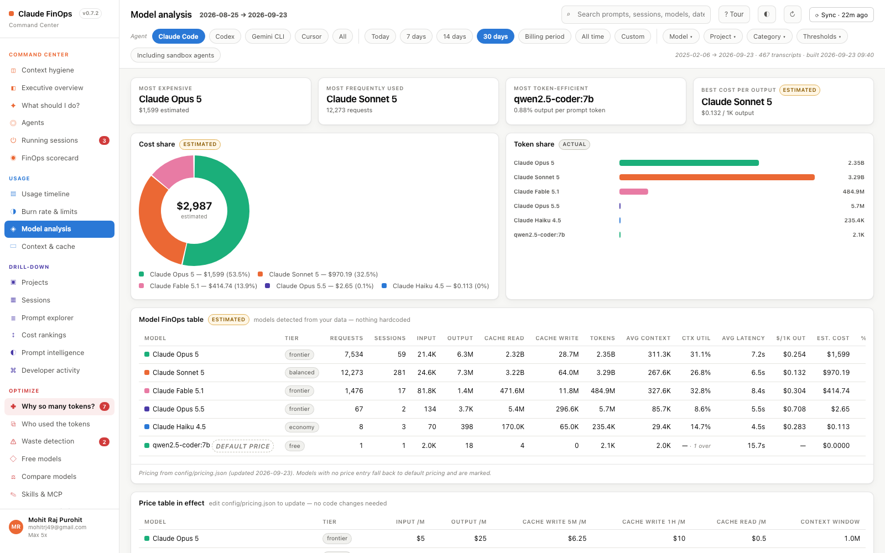

---

## 2. Numbers the method could not support, removed

- Model-switch back-test, trial runner, live model advice, `--advise`, and the prompt hook's "cheaper model" text: deleted end to end (backend, API routes, hook, statusline, dead UI code).
- Waste "excess" is claimed only where the baseline is measured: repeats of an identical prompt within one session, and cache writes that failed break-even at the session's own 5-minute / 1-hour split. Low-yield and frontier-on-small-task rules keep exposed spend but claim no excess.
- The compaction "saving" in session health, the empty saving columns in the report and UI, and the always-None saving fields are gone.
- The printable report gained a Context hygiene section.

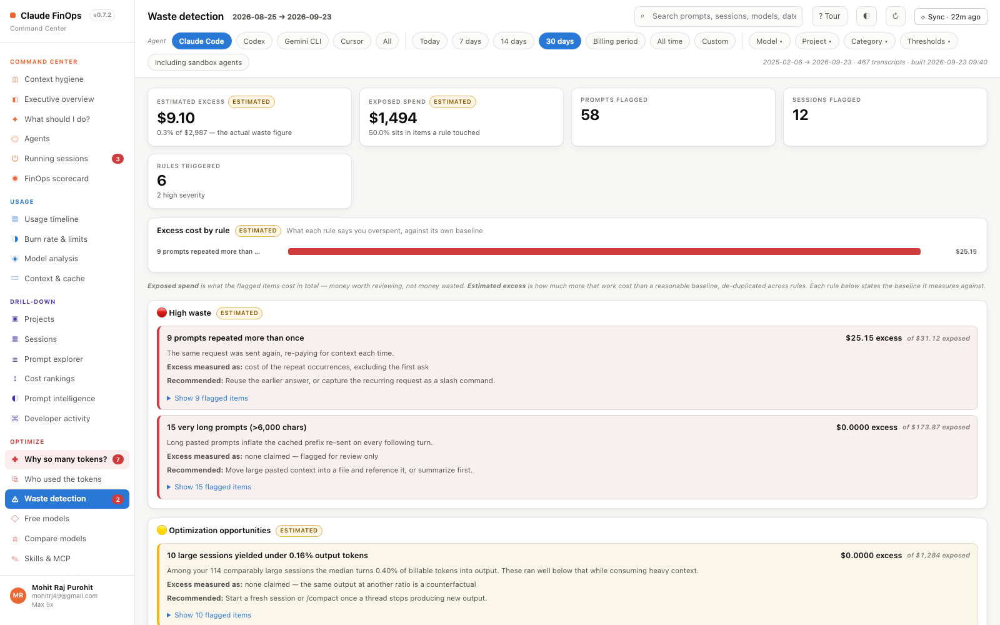

---

## 3. Statistics fixed

**Forecast.** Rate is the mean of the last 14 complete UTC days anchored on the real today; bands are ±1 sd × √(days left); fewer than 7 priced days shows "insufficient history" and no bands. End-of-day and end-of-week extrapolations removed.

**Anomalies.** Median/MAD robust score on zero-filled priced Claude days, so $0 days from other agents no longer make ordinary days look like spikes. Session outliers are labelled "largest sessions".

**Context hygiene.** A compaction (context drops by more than half, or a typed `/compact`) resets "spend after crossing"; the UI shows the original first crossing and the compaction count. 14 compactions detected in the author's data.

**Scorecard.** Collapsed to Context share, Cache break-even and Budget adherence. Token efficiency and Cost efficiency (the same quantity twice), Model selection and Waste control, the letter grade and the unsourced targets are removed.

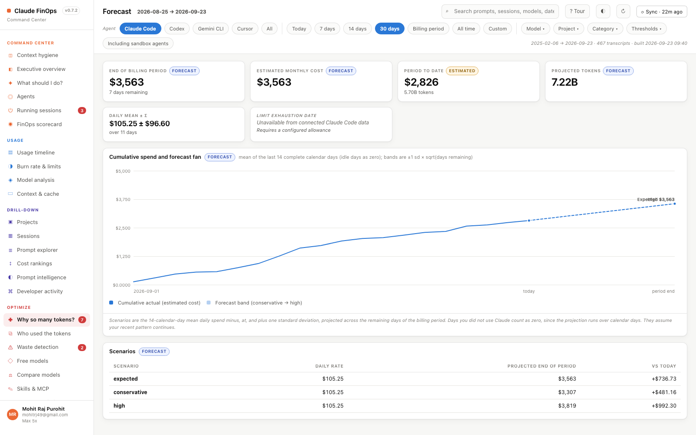

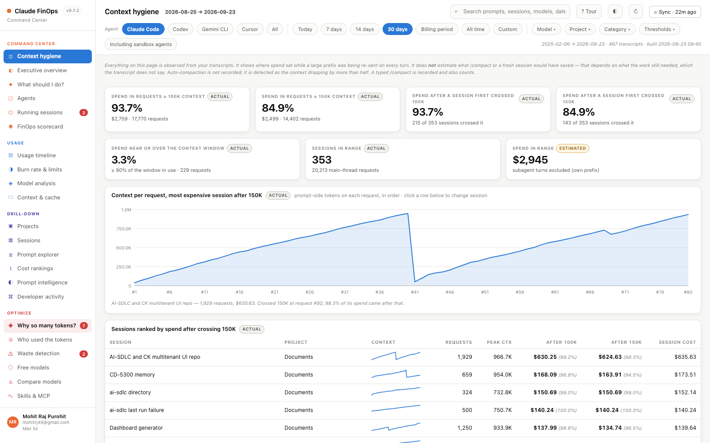

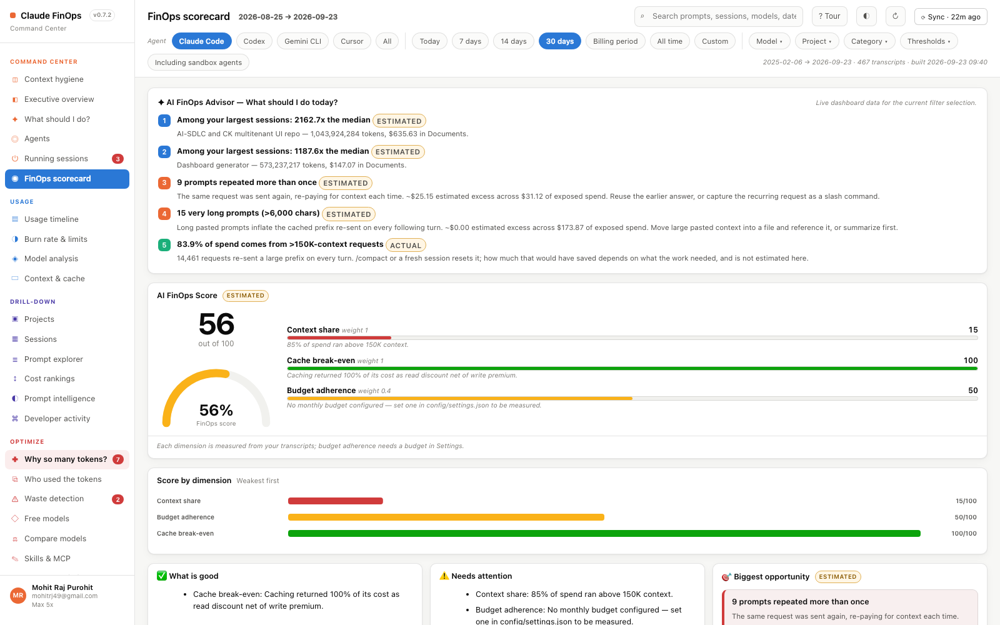

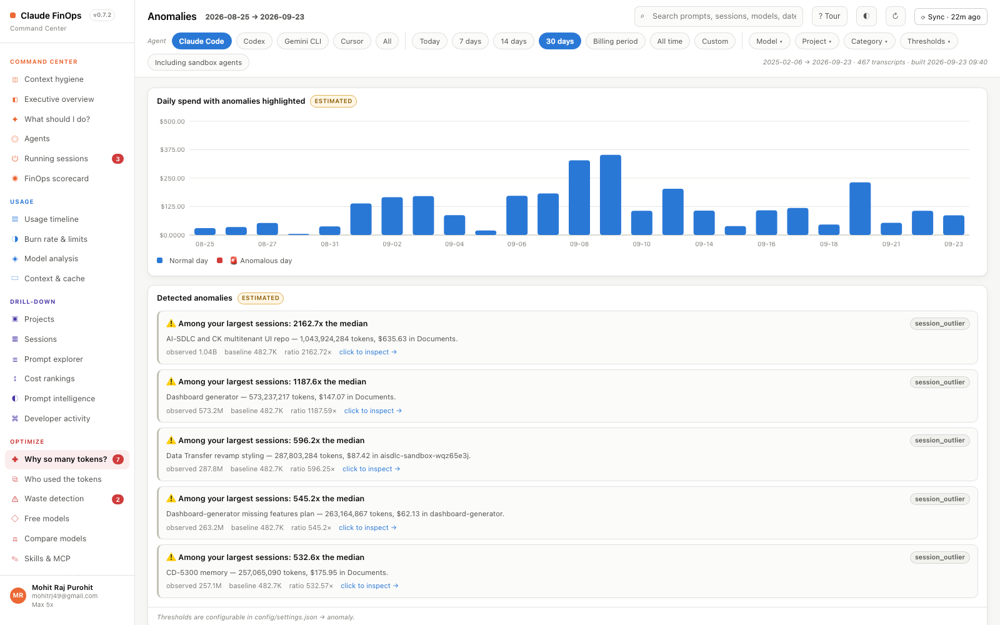

---

## 4. Security and robustness

- `POST /api/settings` requires same-origin plus the action header; values are type-checked (top level and numeric leaves); bad input returns 400. A malformed local settings file no longer takes every page down.
- Bad JSON bodies and non-numeric query params return 400; tracebacks go to `server.log`, not the response. Host header restricted to localhost. `X-Content-Type-Options: nosniff` and a referrer policy on every response. Static file check uses `commonpath`.
- Transcript text is escaped in chart tooltips and legends.
- `run.cmd` no longer runs the app twice on a non-zero exit. The pidfile is always written so `--stop` works. `wmic` replaced with PowerShell. Windows interrupt (which signals the whole console group) removed from the live view. `--no-update-check` flag added; `--version` prints locally before any network call.
- Sessions and prompts are paged with a total and a "Load more" button.
- README network claim corrected to name the daily npm version check. CHANGES.md entry written. `share.sh`, the stale tgz, in-tree `data/` and a leftover Cursor key removed.

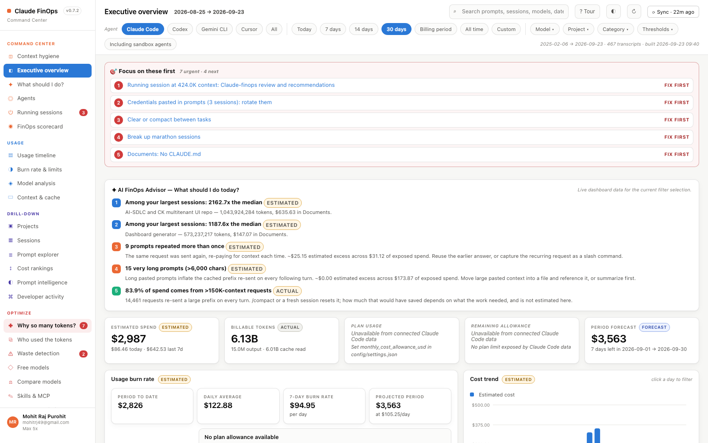

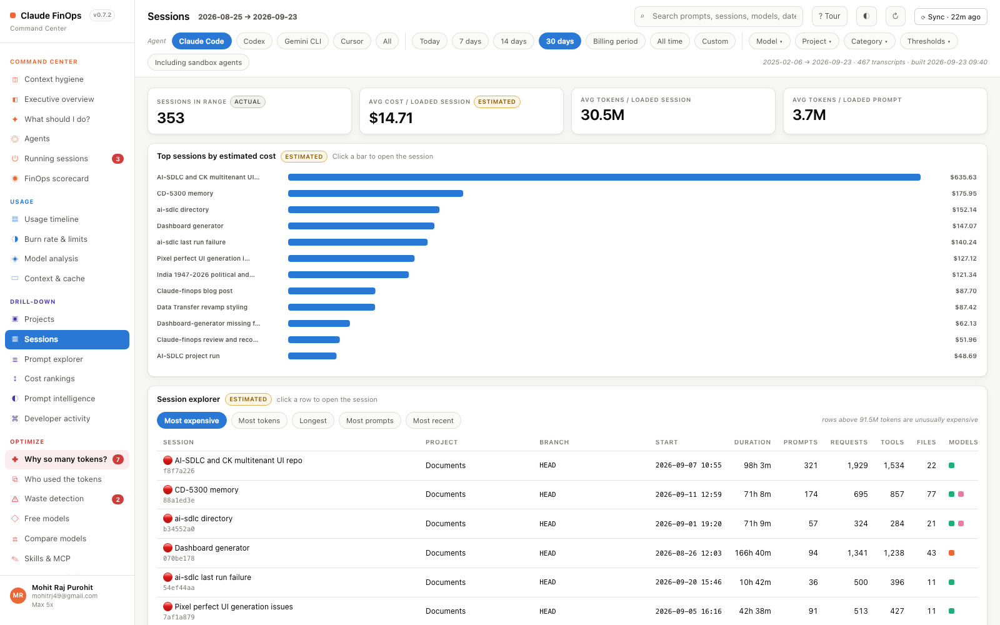

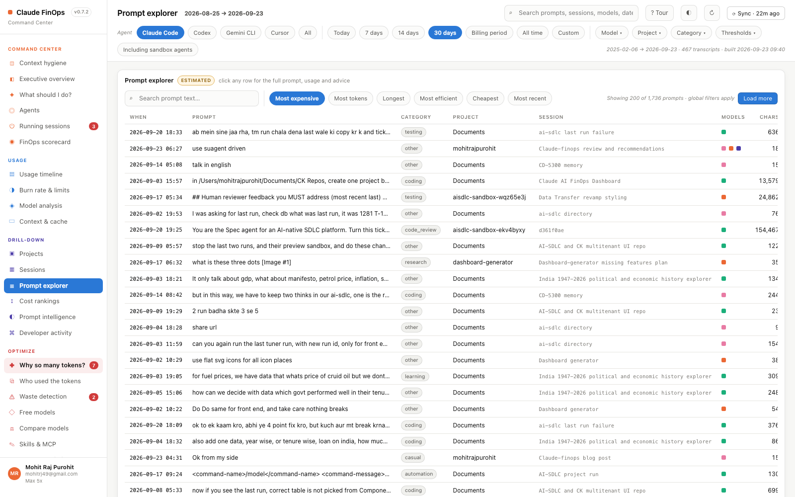

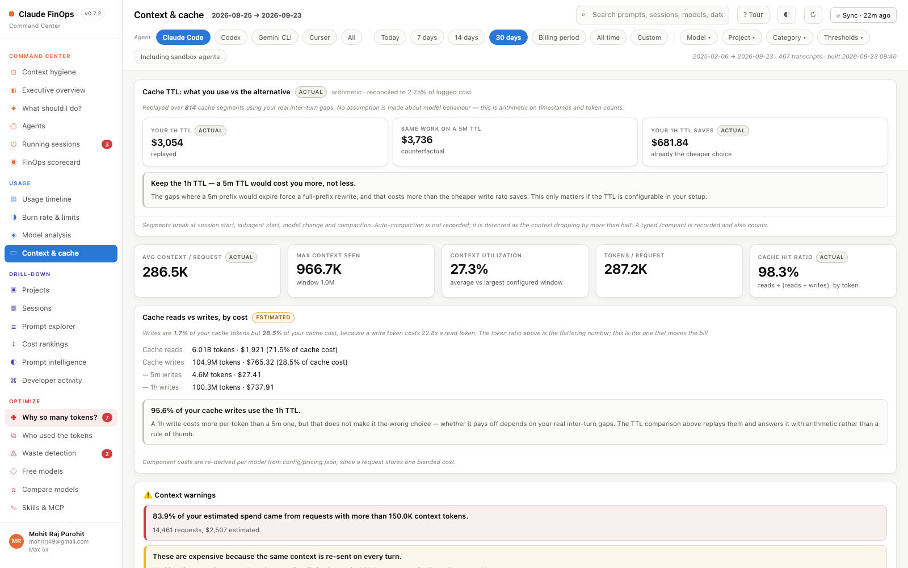

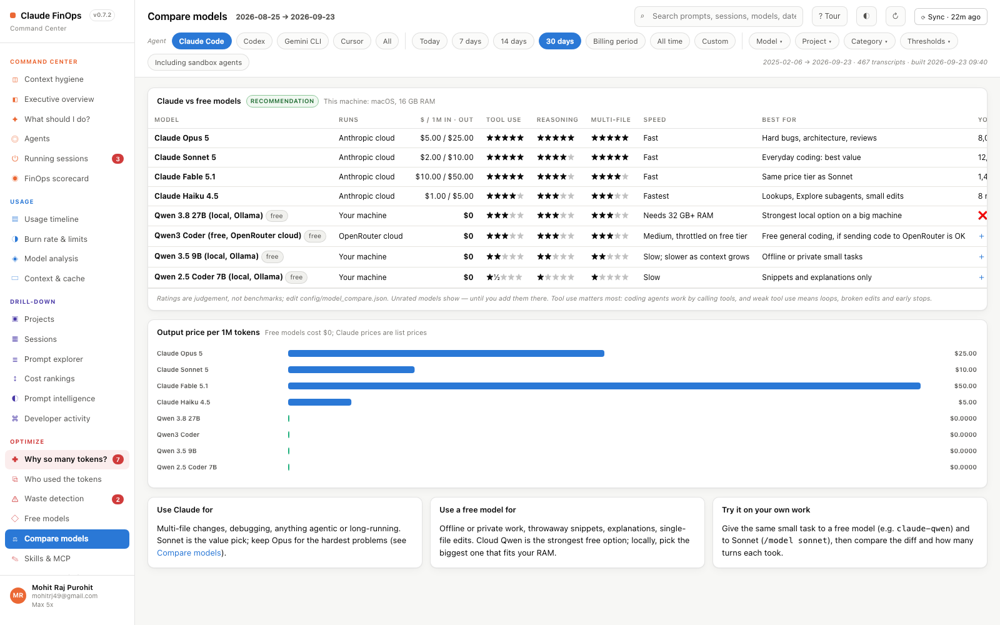

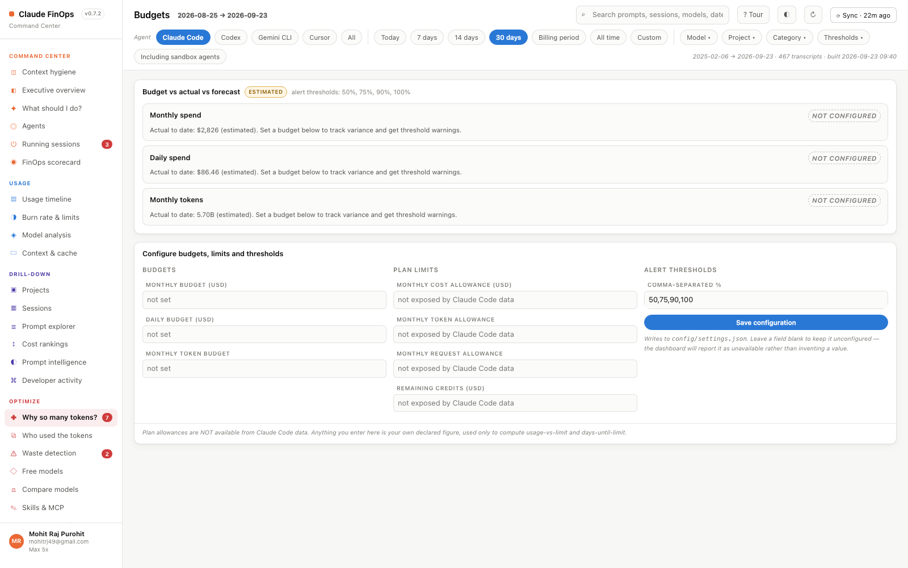

---

## 5. Tests added

ETL grouping, interleaved tool results and attachments, Skill-body capture, injected-line filtering, hash stability, cross-session dedup, schema version; pricing list prices, normalization, fast mode; waste rules and break-even; forecast window, bands, insufficient history; anomalies on zero-cost days; hygiene compaction reset; segments compaction boundary; scorecard dimensions; settings loading and validation; HTTP hardening (CSRF, host, bad input, 500 vs 400); pagination; launcher; tooltip escaping; and a module-import check that fails the suite when a re-export is removed.

---

## 6. Post-merge fix

The final cleanup removed an import from `analytics.py` that `actions.py` re-used, so Compare models, Sync and Free models failed to import. Fixed in 2d1ca8e; the module-import test prevents a repeat.

---

## Commits

```
44e9f00 Add accuracy-and-hardening implementation plan
a0db0af Correct Claude list prices; normalize model ids; unknown ids are unpriced
01e6ab1 Count one request per API call, not one per streamed content block
4b8eafa Keep one request open across its tool results
558f115 Attachments do not close an open request
f54a2a3 Record tool result sizes after the deferred request insert
3fdf55f Skip system-injected user lines; hash full prompt text with sha1
11be528 Version the warehouse schema and rebuild automatically when it changes
e8b7daa Remove the model-switch back-test, trial runner and live model advice
bdfc973 Waste: claim excess only where the baseline is measured
2425d9f Drop the last compaction-saving figure and empty saving columns; add hygiene to the report
14fd839 Forecast and anomalies: complete days only, sqrt(n) bands, robust baseline on priced days
8c7c56e Forecast: 14-day window; fan chart tolerates missing bands
736367d Hygiene resets at compactions; scorecard keeps only measured, non-overlapping dimensions
e15b042 API: same-origin on settings, typed settings validation, 400s instead of tracebacks, host check, nosniff
39c202b API: only BadRequest maps to 400
74615b0 Escape transcript text in chart tooltips
c3736f9 Launcher, pagination and cleanup: fix run.cmd double run, always write pidfile, page sessions, honest network claim, drop share.sh
4098dab ETL: capture Skill body arriving before group flush; dedup request_ids across sessions
c1307b6 Hygiene: expose the original first-crossing index so the UI stops saying "never"
3d4f2ec Pricing: add Claude Opus 5.5 and its fast-mode variant
6fdb8db charts.js: escape legend labels
0c9df29 diagnose.py: remove always-None est_savings_usd/savings_basis; drop hardcoded 0.3 cache-read fallback
ec61d80 api.py: validate settings numeric leaves on POST, validate filter params, coerce bad local settings
df9c54f Retire the prompt hook's "cheaper model" advice; statusline shows model + context % only
0433ecd test_api.py: isolate settings POST tests from the user's real settings.local.json
2d1ca8e Fix actions import broken by dead-import cleanup; add module-import test
```

## Open items (recorded, not yet done)

- Cross-session dedup keeps the first copy by file order; load session files by first timestamp so the original session keeps its rows (about $12 of per-session attribution; totals unaffected).
- Settings save still returns 500 on a malformed local file; `waste_rules`, `anomaly`, `hygiene` and `anchor_day` are not validated on load.
- Minor: forecast chart "Expected" and "High" labels overlap at the right edge; one bad per-project budget entry drops the whole map; `unknown_message` from the pricing note is not rendered.
